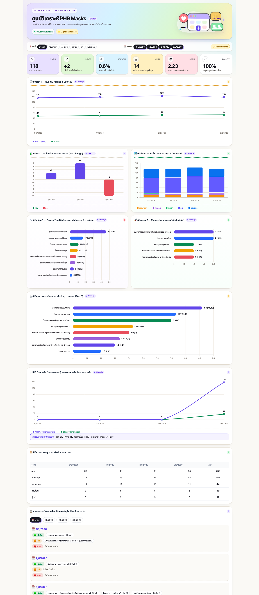
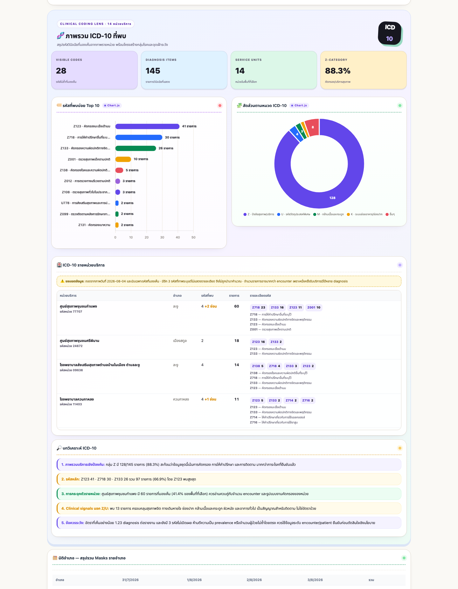

# PHR Masks Dashboard — Satun

Interactive dashboard สำหรับวิเคราะห์ข้อมูล PHR Masks จังหวัดสตูลจาก CSV snapshots รายวัน ออกแบบด้วยธีม **Playful Health Bento Light** และใช้ **Chart.js 4.5.1** ร่วมกับ **chartjs-plugin-datalabels 2.2.0**



### ICD-10 analytics



## Features

- กรองข้อมูลตามอำเภอและวัน
- ค้นหาและเรียงลำดับหน่วยบริการ
- Trend, net change, stacked district, Pareto Top 8 และ horizontal ranking
- Encounters เทียบ Answered พร้อม response rate
- สรุป ICD-10 จากทุกหน่วย: Top 10, หมวดโรค, ตารางรายหน่วย และบทวิเคราะห์
- กรองข้อมูล ICD-10 ตามอำเภอร่วมกับ Dashboard หลัก
- แสดงขอบเขตข้อมูลและจำนวนรหัสที่ภาพต้นทางซ่อนไว้อย่างชัดเจน
- Tooltip, data labels, responsive canvas และ reduced-motion support
- รายงานหน่วยเพิ่มขึ้น ใหม่ และลดลงรายวัน
- จับคู่หน่วยบริการด้วย `hospital_code`
- เลือก snapshot ล่าสุดอัตโนมัติเมื่อวันเดียวกันมีหลายไฟล์
- รองรับ `phr_masks_province_YYYYMMDD_HHMMSS.csv` เพื่อแสดง Province Pulse รอบล่าสุด แยกจากข้อมูลรายละเอียดหน่วยบริการ
- `index.html` เป็นไฟล์ self-contained เปิดแบบออฟไลน์ได้

## Project structure

```text
.
├── index.html                         # Dashboard ที่ build แล้ว
├── analyze_daily_interactive.py      # ตัวสร้าง Dashboard
├── dashboard_data.py                  # ฟังก์ชันอ่าน/สรุป province snapshot และ safe JSON
├── tests/test_dashboard_data.py       # Unit tests สำหรับ province summary
├── icd10_summary.json                # ICD-10 ที่ถอดและตรวจจากภาพ 14 หน่วย
├── vendor/
│   ├── chart.umd.min.js
│   └── chartjs-plugin-datalabels.min.js
└── screenshots/
    ├── dashboard.png
    └── icd10-section.png
```

> CSV ต้นฉบับไม่ถูก commit เพื่อป้องกันการเผยแพร่ข้อมูลที่ไม่จำเป็น

## Build

ต้องใช้ Python 3 เท่านั้น ไม่มี Python package เพิ่มเติม

1. วาง CSV ในโฟลเดอร์ `csv/` โดยใช้ชื่อรูปแบบ:

   ```text
   phr_masks_hospital_YYYYMMDD_HHMMSS.csv
   phr_masks_province_YYYYMMDD_HHMMSS.csv   # optional: ภาพรวมจังหวัดล่าสุด
   ```

2. รัน:

   ```bash
   python3 analyze_daily_interactive.py
   ```

หรือระบุโฟลเดอร์ข้อมูลและไฟล์ output เอง:

```bash
PHR_CSV_DIR=/path/to/csv \
PHR_DASHBOARD_OUT=/path/to/index.html \
python3 analyze_daily_interactive.py
```

## Required CSV columns

```text
province_name,district_name,hospital_code,hospital_name,hospital_type,
masks,encounters,answered,citizens,matched,unmatched,match_rate_pct
```

ฟิลด์ `encounters` และ `answered` รองรับกรณีไฟล์รุ่นเก่าไม่มีค่า โดยระบบจะใช้ `0`

## ICD-10 data scope

`icd10_summary.json` เก็บรหัส ICD-10 ที่มองเห็นจากภาพสรุปรายหน่วย ณ วันที่ 2026-08-04 เท่านั้น ข้อมูลบางภาพระบุว่ามีรหัสเพิ่มเติมแต่ไม่แสดงรายละเอียด ระบบจึงบันทึกจำนวนไว้ใน `hidden_code_count` และไม่นำรหัสที่ไม่เห็นมาคาดเดาหรือรวมในการคำนวณ

จำนวน diagnosis อาจมากกว่าจำนวน encounter เพราะหนึ่ง encounter สามารถมีได้หลาย diagnosis ตัวเลขใน Dashboard จึงไม่ควรถูกตีความเป็น prevalence หรือจำนวนผู้ป่วยไม่ซ้ำโดยตรง

## Preview locally

```bash
python3 -m http.server 8765
```

จากนั้นเปิด <http://127.0.0.1:8765/>

## Chart libraries

- [Chart.js 4.5.1](https://www.chartjs.org/)
- [chartjs-plugin-datalabels 2.2.0](https://chartjs-plugin-datalabels.netlify.app/)

Library ทั้งสองถูก pin version และฝังเข้า `index.html` ขณะ build เพื่อให้ Dashboard ทำงานแบบ offline ได้
